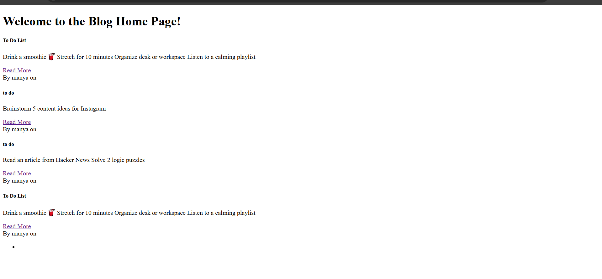
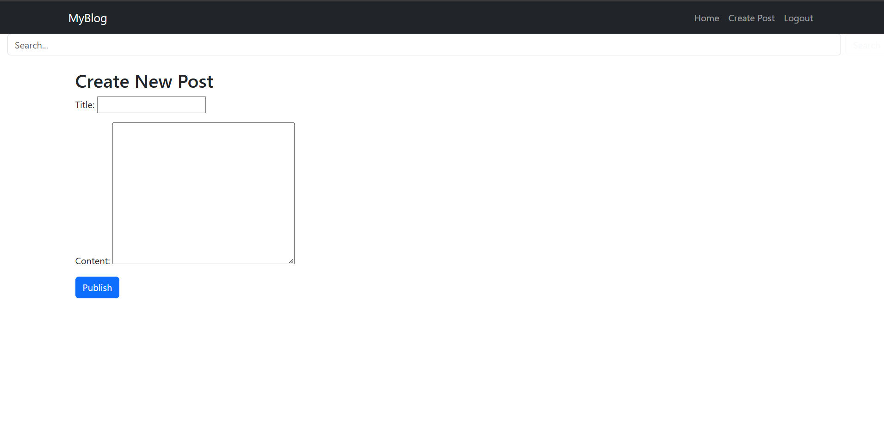

# Django Blog App

Name:Manya  
Roll Number: 2K22CSUN01238
---

## 📝 Overview

This is a simple yet fully functional Django-based Blog Application where users can:

- Register and login
- Create, read, update, and delete blog posts
- Comment on posts
- Search for posts by keyword
- Logout securely

This project demonstrates use of Django models, views, templates, authentication, and Bootstrap styling.

---

## 🛠️ Tech Stack

- Backend: Django 5.2
- Frontend: HTML, CSS (Bootstrap)
- Database: SQLite3
- Deployment: GitHub

---

## 🚀 Features Implemented

### ✅ Core Features:
- User registration and login
- Post creation and editing
- Post deletion with confirmation
- Post listing and detailed view
- Comment system
- Logout functionality

### ✨ Enhanced Features:
- Search bar to find posts
- Bootstrap-based UI styling
- Responsive navbar

### 🧪 Optional:
- Error handling (e.g., 404 pages)
- Authentication required for CRUD

---

## 📸 Screenshots

### Home Page
](screenshots/homepage.png)

### Create Post Page
](screenshots/createpost.png)


---

## ⚙️ Setup Instructions

1. Clone the repo
```bash
git clone https://github.com/manyaax/Blog_app.git
cd Blog_app
